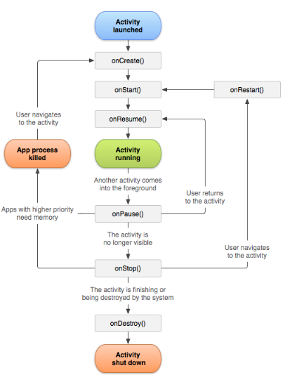

# Activity Life Cycle
There are a couple of events that occur when we view an activity and we change the activity.

### onCreate() 
- Se ligaron las vistas que tenemos en el Layout con las vistas de Kotlin. 
- onCreate should not be called again, unless the app is closed.

### onStart()
- There are some UI elements visible for users. 

### onResume()
- Once called the user can interact with the activity. 

### onPause() 
- Occurs when activity goes foreground

### onStop()
- The activity is no longer visible. 

### onDestroy()
- Occurs when closing the app. 

