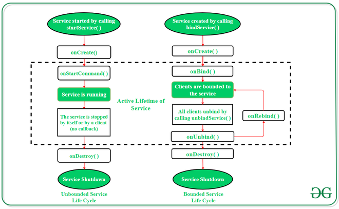

# Android components

### Broadcast Receivers
- Listens for system wide events. (If there is Wi FI, etc).

### Content Providers
- Manage access to data.
- Allows communication between apps.

## Services
Actions or methods that run without a UI.
- **Foreground:** Tasks that require user interaction.
- **Background:** Perform tasks that are invisible to the use. 
- **Bound:** Tasks bound to a component.

### Service lifecycle


### Code example
Reproducing a sound
1. Create a Class that inherits from Service (android.app.Service) <- Be careful there are many Service classes on Android Studio
```kotlin
class MyService: Service() {
    lateinit var mediaPlayer: mediaPlayer

    override fun onBind(intent: Intent?): IBinder {
        return null 
    }

    override fun onStartCommand(intent: Intent?, flags: Int, startId: Int): Int {
        mediaPlayer = MediaPlayer.create(this, Settings.System.DEFAULT_RINGTONE)  // # android.provider.Settings
        mediaPlayer.isLooping = true
        mediaPlayer.start() 

        return START_STICKY
    }

    override fun onDestroy() {
        mediaPlayer.stop() 
        super.onDestroy()
    }
}
```

2. On main activity add a button and on the listener event we start the service.
```kotlin
... (inside onCreate) 
val startButton = findViewById<Button>(R.id.button)
val stopButton = findViewById<Button>(R.id.button2)

startButton.setOnClickListener {
    val startIntent = Intent(applicationContext, MyService:: class.java)
    startService(startIntent)
}

stopButton.setOnClickListener {
    val stopIntent = Intent(applicationContext, MyService:: class.java)
    stopService(stopIntent)
}
...
```

3. For each service on the AndroidManifiest.xml add a service tag. 
```
...
  <application ...>
  ...
    <service android:name=".MyService">
  </application>
...
```

4. If the app uses an internet audio you need to add a permission on the AndroidManifest 

```kotlin
<user-permission android:name"android.permission.INTERNET"/>
```

## Broadcast Receiver
Allows handling system wide broadcast messages. Some events are: 
- Screen rotation
- Low batery
- AirPlane mode. 

### Example: 
App that tells if airplane mode is on or off

1. Create the broadcast receiver 
```kotlin 
class AirPlaneBroadcastReceiver: BroadcastReceiver() {
    override fun onReceive(context: Context?, intent: Intent?) {
        if (intent?.action != null && intent.action.equals(Intent.ACTION_AIRPLANE_MODE_CHANGED)) {
            var isAirplaneModeOn = intent.getBooleanExtra("state", false)
            Log.d("AirPlaneBroacastReceiver", "Airplane state: " (if (isAirplaneModeOn) "ON else "False)")
        } 
    }
}
```

2. Register a broadcastReceiver on MainActivity


```kotlin
lateinit var airPlaneBroadcastReceiver: AirplaneBroadcastReceiver

override fun onCreate() {
    ...
    airPlaneBroadcastReceiver = AirPlaneBroadcastReceiver()
    val intentFilter = IntentFilter("android.intent.action.AIRPLANE_MODE") // Listen to arplane
    registerReceiver(airplaneBroadacastReceiver, intentFilter)
    ...
}


override fun onDestroy() {
    unregisterReceiver(airplaneBroadcastReceiver)
    super.onDestroy()
}
```

**Example2**: Register in the manifest (is not usual)

```kotlin
override fun onReceive(context: Context?, intent: Intent?) {
    if (intent?.action != null && intent.action.equals(Intent))
    ... 
}
``` 

```.xml
<application ...>
    <receiver android:name=".MyBroadcastReceiver"
    android:exported="true">
    <intent-filter>
        <action android:name="android.intent.action.LOCALE_CHANGED" />
    </intent-filter>
</application>

```

### Sending and Receiving local events
Register: 
```kotlin
class CustomBroadcastReceiver: BroadcastReceiver() {
    override fun onReceive(context: Context?, intent: Intent?) {
        if (intent?.action != null) {
            val value = intent.getStringExtra("key")
            Log.d("CustomBroadcastReceiver", "the value is" + value)
        }
    }
}
```

```kotlin
lateinit var customReceiver: CustomBroadcastReceiver

onCreate() {
    ... 
    val customReceiver = IntentFilter("application.package")
    customReceiver = CustomBroadcastReceiver()
    LocalBroadcastManager.getInstance(this).registerReceiver(myCustomBroadcastManager, customIntentFilter)

    val button = findButton... 
    button.setOnClickListener {
        val intent = Intent("com.example.package.CUSTOM_EVENT")
        intent.putExtra("key", "value")
        LocalBroadcastManager.getInstance(this).sendBroadcast(intent)
    }
}
LocalBroadcastManager.getInstace(this)

var intentFilter: IntentFilter = IntentFilter("com.example.broadcastclass.CUSTOM_ACTION")
my customBroadcastReceiver = MyCustomBroadcasatReceiver()

```