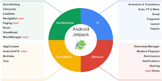

# Android jetpack

- A suite of libraries to help developres follow best practices.
- Reduces boilerplate code. 
- Make more consistent code.

Jetpack provide features for this areas:



## Data binding
- A support library that allows linking vars to layout components.
- Stop using findViewById<>()
- Allows improving performance and helps prevent memory leaks

### Enable data binding
- On build.gradle.kts (Module: app) add 

```
buildFeature {
    dataBinding: true
}
```

## Two way data binding 

