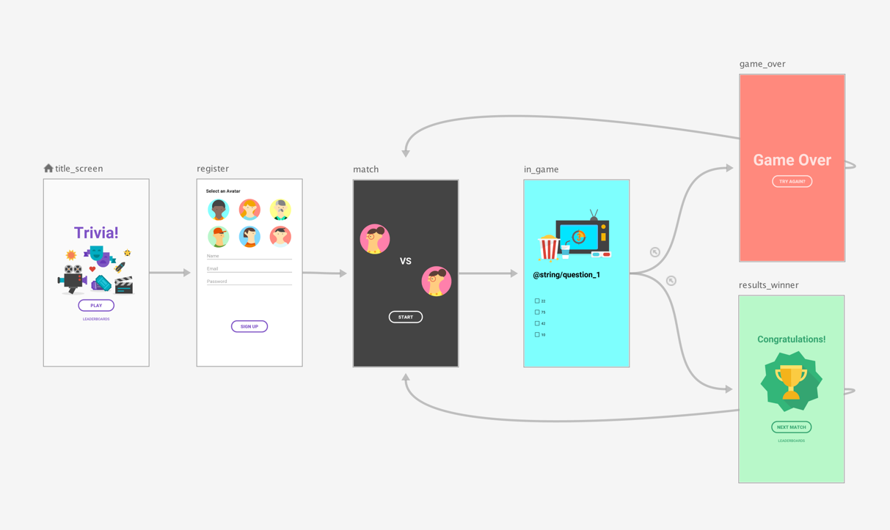

# Jetpack Navigation 
Is a library to build fragments: 
- Handles transaction.
- Handling up and back actions correctly by default. 
- Providing standarized resource for navigations.
- Implement handling and deep linking (Links that open apps).
- Includes navigation IO patterns. 
- Safe args for navigating and passing data between destinations. 
- ViewModel support

## Navigation Graph
- A resource type that defines all the possible paths a user can take through an app. 
- It shows visually all the destinations that can be reached from a given destination.

## NavHost: 
- Reads info of the navigation graph. 

## NavController: 
- Manages app navigation within a NavHost.